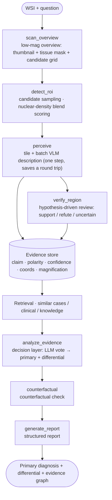

# PathAsk

English | [简体中文](README.md)

[](LICENSE)
[](#requirements)
[](https://github.com/Golden-Promise/pathask/actions/workflows/ci.yml)

> A conversational whole-slide-image (WSI) pathology agent — ask a question about an entire slide and get back a **research-grade report with a traceable chain of evidence**.

Given a WSI and a question, the agent decides for itself how to work: scan at low magnification → pick regions → zoom in → have a pathology VLM describe what it sees → pull clinical and knowledge context → synthesize. The output is not a single classification label but a report where **every conclusion points back to coordinates, magnification, and morphological description** — and it can be interrogated.

The agent skeleton is built on [pi-agent](https://github.com/earendil-works/pi) (`pi-ai` + `pi-agent-core`); visual understanding comes from an open-source pathology VLM, and decisions are made by a text-only LLM.

## Highlights

- **Evidence chain, not a label** — conclusion → region coordinates → magnification → morphological description → support/refute polarity. `counterfactual` can drop a single piece of evidence to see whether the conclusion flips.
- **Perception and reasoning are separated** — the pathology VLM only reports *what it sees*; decisions are made by a text-only LLM. Both are **swappable OpenAI-compatible endpoints**. This project trains and distributes no weights.
- **No automatic retries** — transient failures only grant a "retry budget" and change **what the model is told**; the decision always stays with the model. Timeouts fall back to rule-based voting rather than silently re-sending.
- **Degraded evidence is excluded from voting** — partial evidence from timeouts or truncation is explicitly flagged and **does not count toward the vote**, preventing a "model goes down → every patch becomes a bland template" collapse into a benign call.
- **Circuit breaking distinguishes evidence strength** — connection-class failures are unambiguous evidence that a service is dead, so they are recorded at service level; timeouts are ambiguous, so they are attributed to an individual slide first, preventing one pathological gigapixel slide from condemning an entire service.
- **Loop governance is measurable** — step / token / VLM budgets, repeated-call fingerprints, no-progress and oscillation detection. Observability is on by default with zero behavior change; interventions are always env-gated.

## Quick Start

```bash
git clone --recurse-submodules https://github.com/Golden-Promise/pathask.git
cd pathask
npm install
cp .env.example .env      # fill in endpoints and keys as needed
npm run typecheck         # tsc --noEmit
npm run dev               # offline scripted loop (see below)
```

### What `npm run dev` actually runs

It runs the **offline scripted loop**: LLM decisions are replayed from a pre-written sequence in `src/mock/mockStreamFn.ts`, and the data comes from `src/mock/mockData.ts`.

**The tools, evidence store, voting, and report are all real** — all 10 tools genuinely execute, evidence genuinely lands in the store, voting genuinely runs, and a real report object comes out. Only the **model decisions** and the **data** are fake. So it verifies that "the wiring and tool orchestration are not broken" — it **does not represent real reading capability**.

It is deterministic, makes no network calls, and writes nothing to disk (`main.ts` calls `runQuestion` without a session, so report persistence is not triggered). That is why it also runs as the end-to-end smoke step in CI.

> ⚠️ **The offline run prints a batch of alarming-looking warnings. This is expected:**
> - `[describe_patch] Patho-R1 不可用，降级模板：EISDIR ...` — with no VLM endpoint, the describer degrades to a lookup table keyed by `region_label`. Such evidence is marked as a stub and **excluded from voting** (the degradation branch in `src/tools/describePatch.ts`), and is listed separately in the report as "⚠️ VLM degraded template (not a microscopic observation, excluded from voting)".
> - `[analyze_evidence] 决策 LLM 失败，回落规则投票: 缺少 SILICONFLOW_API_KEY` — the decision layer falls back to rule-based voting.
>
> In other words, offline mode **also exercises the degradation paths**. The resulting diagnosis therefore has **no clinical meaning** — use it to check that the pipeline is intact, nothing more.

### Wiring up real endpoints

Real reading requires three things:

1. A **WSI registry + slide files** (the JSON pointed to by `PATHASK_WSI_REGISTRY`, mapping `slide_id → slide path`)
2. A **pathology VLM endpoint** (`VLLM_BASE_URL` / `VLLM_MODEL`)
3. A **decision LLM endpoint** (`PATHASK_LLM_BASE_URL` / `PATHASK_LLM_MODEL`, or a SiliconFlow key)

> ⚠️ **`createRealSession()` (`src/session.ts`) is implemented but not wired to any entry point** — `src/main.ts` takes the mock branch.
> To run real reading you need to connect `createRealSession()` to `runQuestion()` yourself (roughly a dozen lines).
> This is **not a turnkey demo**; it is a readable, reusable reference implementation.

### Starting the WSI bridge

TypeScript cannot drive OpenSlide (a Python library), so there is a thin FastAPI bridge:

```bash
pip install -r wsi-bridge/requirements.txt   # openslide-python / fastapi / uvicorn
python wsi-bridge/server.py                  # defaults to http://127.0.0.1:8787
```

The registry and the WSI files **are not in this repository** — bring your own slides and request access from the corresponding data sources (see [`THIRD_PARTY_NOTICES.md`](THIRD_PARTY_NOTICES.md)).

## Architecture



The mandatory closing order is `analyze_evidence → counterfactual → generate_report`; emitting "diagnosis report"-style prose without calling `generate_report` counts as a failure.

```
src/
├── loop/          agent loop layer
│   ├── agentFactory.ts      createPathAskAgent: assembles model + tools + loop governance
│   ├── protocol.ts          system prompt protocol (reading workflow / tool contract / closing rules)
│   ├── governance.ts        loop governance: step/token/VLM budgets, repeat fingerprints, no-progress & oscillation detection
│   ├── fingerprint.ts       normalized tool-call argument fingerprints (detects "same-args repeats")
│   ├── siliconflowStreamFn.ts  streaming adapter for the orchestration LLM (OpenAI-compatible)
│   └── compactContext.ts    context compaction (⚠️ off by default)
├── tools/         10 AgentTools
├── wsi/           WSI access: bridge client, ROI sampling, navigator, CONCH/PLIP retrieval
├── util/          resilience.ts (endpoint circuit breaking + transient-failure retry budget), llmEndpoint.ts (endpoint dispatch)
├── evidence/      evidence store (per-session)
├── knowledge/     knowledge base retrieval
├── data/          diagnosis spectrum (organ → disease vocabulary + morphological evidence signatures)
├── mock/          offline stubs (scripted LLM + fixed data, so the loop runs without endpoints)
└── runner.ts      per-case orchestration (hotspot loop, dual-magnification review — paths the agent does not call directly)

wsi-bridge/        TypeScript cannot drive OpenSlide, so this thin FastAPI bridge exposes WSI reading over HTTP
```

### What the report looks like

```ts
interface Report {
  primary_diagnosis: string
  confidence: number
  differential: DifferentialDiagnosis[]        // diagnosis + evidence for + evidence against + confidence
  evidence_graph: { nodes: EvidenceNode[]; edges: EvidenceEdge[] }
  uncertainty?: { type; recommended_action }    // an explicit "needs review" when evidence is insufficient, not a disclaimer
}
```

Every evidence node carries a `source`: tool name, `coords` (`x/y/w/h`), `magnification`, model name, and degradation flags such as `stub` / `degenerate` / `fallback`.

### Tools (the 10 registered by `createTools`)

| Tool | Purpose |
|---|---|
| `scan_overview` | Low-magnification overview: thumbnail + tissue mask + candidate grid |
| `detect_roi` | Score and pick candidate ROIs (default blend = nuclear + tissue density), returns a `region_ref` |
| `perceive` | **Single "tile + batch VLM description"** step, replacing `inspect_region → describe_patch`, saving one agent round trip |
| `verify_region` | Hypothesis-driven review: ask "is X visible here?" → support / refute / uncertain |
| `query_clinical` | Clinical information retrieval |
| `query_knowledge` | Knowledge base retrieval |
| `retrieve_similar_case` | Similar-case retrieval (CONCH vector store) |
| `analyze_evidence` | **Decision layer**: hands all evidence to the LLM for a case-level judgment |
| `counterfactual` | Counterfactual: drop one piece of evidence and see whether the conclusion flips |
| `generate_report` | Closing step: produce the structured report |

> `inspect_region` / `describe_patch` remain in the source but are **no longer exposed to the agent** — they are called
> directly by internal `runner.ts` paths (hotspot loop, dual-magnification review) and by `perceive`.

### The two models

| Role | Default | Environment variables |
|---|---|---|
| **Decision / orchestration LLM** (text-only) | SiliconFlow `Qwen/Qwen3-8B` | `PATHASK_LLM_BASE_URL` / `PATHASK_LLM_MODEL` |
| **Pathology VLM** (reads images) | self-hosted `patho-r1-7b` | `VLLM_BASE_URL` / `VLLM_MODEL` |

Both are **swappable OpenAI-compatible endpoints** — this project trains and distributes no weights.

### How pi-agent is wired in

Two lines, with distinct jobs:

| | Purpose | Location |
|---|---|---|
| **git submodule** | **Pins the upstream source provenance**: attribution, origin, an auditable version anchor | `pi-agent/` → [`earendil-works/pi`](https://github.com/earendil-works/pi) @ `dcd461925` |
| **npm dependency** | What actually participates in the build | `@earendil-works/pi-ai` / `pi-agent-core` / `pi-telemetry`, pinned to exactly `0.84.3` |

Why not use `file:` against the submodule for everything: upstream is a monorepo and the packages' entry points target `dist/`,
which is a **build artifact and not in git** — using `file:` would mean first getting the whole monorepo through
`npm install && npm run build` (8 packages plus `tsgo`). For a repository meant primarily to be read,
depending directly on the **same version** of the published packages is simpler, and the version corresponds to the commit the submodule pins.

> If you want to modify pi itself: `npm i ./pi-agent/packages/ai ./pi-agent/packages/agent` switches to a local build,
> but you must first get the monorepo building per upstream's README.

This project **does not modify** the submodule contents — all adaptation happens at the `src/` layer.

## Requirements

| | Requirement | Notes |
|---|---|---|
| **Node.js** | **≥ 22.19** | The floor comes from `undici@8.10.2`'s own declared `engines` (the `engines` field in `package.json` matches) |
| **Python** | 3.10+ | Only needed for the WSI bridge |
| **OpenSlide** | system library | `openslide-python` depends on it; install per your distribution (`apt install libopenslide0` / `brew install openslide`) |
| **Python packages** | see `wsi-bridge/requirements.txt` | `openslide-python>=1.4`, `numpy>=1.26`, `pillow>=10`, `fastapi>=0.110`, `uvicorn>=0.29` |

The model endpoints (pathology VLM / decision LLM) are **not installation dependencies** — the offline stubs need neither.

## Design Notes

A few non-obvious decisions that were learned the hard way. They are documented in the header comments of
`src/util/resilience.ts`, `src/loop/governance.ts` and friends; the most worthwhile are listed here:

- **Three things must change together when dispatching to a self-hosted endpoint** (`src/util/llmEndpoint.ts`): **proxying**
  (undici's `ProxyAgent` does **not** read `NO_PROXY`, so an internal endpoint must have no dispatcher attached),
  the **thinking field** (vLLM's top-level `enable_thinking` is a no-op; you must send `chat_template_kwargs`),
  and the **default timeout** (240s → 120s).
- **Circuit breaking only prevents "paying twice"** (`resilience.ts`): connection-class failures are **unambiguous** evidence
  a service is dead → recorded at service level. Timeouts are **ambiguous** → attributed to an (endpoint, slide) pair first,
  and only escalate to service level when enough **distinct** slides time out within the window
  (otherwise one pathological gigapixel slide could condemn the whole service). Business-level 4xx **never enters the breaker** —
  that is a data problem, not a health signal.
- **No automatic retries**: transient failures only grant a "retry budget" and change **what the model is told**.
  A timeout falls back to rule-based voting rather than silently re-sending.
- **Degraded evidence is excluded from voting**: partial evidence from timeouts or truncation is flagged and **not counted**.
- **Loop governance is defensive** (`governance.ts`): observability is on by default with zero behavior change; interventions are always env-gated.
  Its value is **bounding runaway loops that could happen**, and making the loop itself measurable.
- **ROI sampling scores by nuclear density, not raw tissue density**: `tissue_fraction` counts collagen, smooth muscle, and
  empty space all as "tissue", so nuclei-dense tumor foci rank *low* → sampling systematically favors benign connective tissue.
  The default is `PATHASK_ROI_SCORE=blend` (0.6 × nuclear + 0.4 × tissue).

## Honest Boundaries

- **A research-grade tool, not a medical device. It does not claim clinical usability** and does not override a pathologist.
- The agent does not raise the intrinsic accuracy of the underlying models; when the VLM is weak, it merely "fails gracefully".
- The default configuration in this repository is **pinned for reproducible evaluation**, not an "optimal product configuration".
- The offline stub's final diagnosis has **no clinical meaning** — it verifies wiring, not reading.

## Publication Scope

**Included**: `src/` (all agent source), `wsi-bridge/` (the WSI bridge), configuration templates, and documentation.

**Not included** (kept in the private tree):
- Evaluation sets and gold annotations (redistribution terms for the three external data sources are **unconfirmed**)
- WSI slides, slide registries, CONCH vector stores, model weights
- Evaluation harness, data-construction scripts, deployment scripts (including internal cluster configuration)
- Clinical data or any patient-identifiable information

De-identification performed: internal hostnames, private IPs, cluster absolute paths, and archived slide-id examples
have been removed from source and documentation or replaced with placeholders.
**An n-gram overlap check was also run**: the published surface contains no ≥40-character fragment of evaluation-set source report text.

### The two endpoint defaults are the only *intentional* divergence

This repository is a code subset synced from a private development tree **at release time**, not a live mirror —
it may therefore **lag behind** that tree. Lag is not divergence.

Exactly two lines differ **by design**, both endpoint defaults:

| Location | Private tree | This repository |
|---|---|---|
| `DEFAULT_LLM_BASE_URL` in `src/util/llmEndpoint.ts` | real internal address | loopback placeholder `http://127.0.0.1:8014/v1` |
| `VLLM_BASE_URL` fallback in `src/tools/describePatch.ts` | real internal address | loopback placeholder `http://127.0.0.1:8012/v1` |

**Do not copy either line across when syncing `src/`** — pulling the private address in breaks the de-identification
boundary; pushing the loopback placeholder back makes the private tree unreachable by default. There is no
de-identification or sync script; the rule is upheld by hand.

> ⚠️ The model id is **derived from the endpoint** (`llmModelId()`): `Qwen/Qwen3-8B` for SiliconFlow,
> `qwen3-8b` otherwise. Changing only the URL leaves an unmatched id → HTTP 404 → the decision layer
> **silently falls back** to rule-based voting, while the logs look like a clean run. See `.env.example`.

## Citations and Acknowledgements

- **pi-agent** — MIT, © 2025 Mario Zechner, <https://github.com/earendil-works/pi>. Referenced as a submodule, unmodified.
- Sources for the three data sources (**TCGA/GDC**, **HISTAI**, **HistGen**) and for several model weights are in
  [`THIRD_PARTY_NOTICES.md`](THIRD_PARTY_NOTICES.md). **This repository contains none of their data or weights.**

## License

This project is **MIT** — see [`LICENSE`](LICENSE).

Upstream pi-agent is also MIT; its copyright and license notice is retained in full in
[`THIRD_PARTY_NOTICES.md`](THIRD_PARTY_NOTICES.md) as MIT requires.
