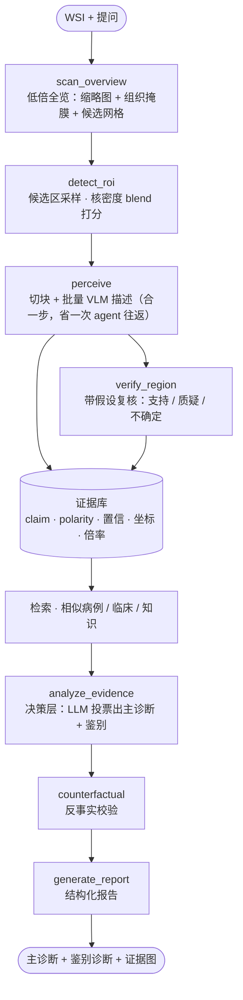

# PathAsk

[English](README.en.md) | 简体中文

[](LICENSE)
[](REQUIREMENTS.md)
[](https://github.com/Golden-Promise/pathask/actions/workflows/ci.yml)

> 对话式全片病理（WSI）阅片 agent —— 对整张切片提问，输出**带证据链**的研究级分析报告。

丢给 agent 一张 WSI 和一句问题，它自己决定「低倍扫 → 挑区域 → 放大 → 让病理 VLM 描述 → 拉临床/知识 → 综合判断」。产出的不是单个分类标签，而是**每个结论都能指回坐标、倍率与形态学描述**的报告，并且可以被追问。

agent 骨架用 [pi-agent](https://github.com/earendil-works/pi)（`pi-ai` + `pi-agent-core`）二次开发；视觉理解接开源病理 VLM，决策接纯文本 LLM。两者都是**可替换的 OpenAI 兼容端点**，本项目不训练也不分发任何权重。

## 工具集（`createTools` 注册的 10 个）

| 工具 | 作用 |
|---|---|
| `scan_overview` | 低倍全览：缩略图 + 组织掩膜 + 候选网格 |
| `detect_roi` | 按打分挑候选 ROI（默认 blend = 核密度 + 组织密度），返回 `region_ref` |
| `perceive` | **单次「切块 + 批量 VLM 描述」**，替代 `inspect_region → describe_patch` 两步，省一次 agent 往返 |
| `verify_region` | 带假设的复核：对某区域问「是否见到 X」，返回 支持/质疑/不确定 |
| `query_clinical` | 临床信息检索 |
| `query_knowledge` | 知识库检索 |
| `retrieve_similar_case` | 相似病例检索（CONCH 向量库） |
| `analyze_evidence` | **决策层**：把全部证据交给 LLM 做病例级判断 |
| `counterfactual` | 反事实：剔除某条证据看结论是否翻转 |
| `generate_report` | 收尾：产出结构化报告 |

> `inspect_region` / `describe_patch` 仍在源码里，但**不再暴露给 agent**——由 `runner.ts` 的内部路径
> （热点闭环、双倍率复核）与 `perceive` 直接调用。

## 报告长什么样

报告是一个纯数据的 `Report` 对象：

```ts
export interface Report {
  primary_diagnosis: string
  confidence: number
  differential: DifferentialDiagnosis[]        // 鉴别诊断：诊断 + 支持证据 + 反对证据 + 置信
  evidence_graph: EvidenceGraph                // { nodes: EvidenceNode[]; edges: EvidenceEdge[] }
  uncertainty?: Uncertainty                    // 证据冲突/不足时的显式「待评估」，而非免责声明
}

export type EvidenceRelation = 'supports' | 'contradicts' | 'excludes' | 'refines'
```

每条证据节点都带 `source`：工具名、`coords`（`x/y/w/h` + 倍率 + 打分）、`magnification`、模型名，以及 `stub` / `degenerate` / `fallback` 等**降级标记**——被标记的观察不进投票。

下面这份是 `npm run dev`（离线桩）跑出来的**真实输出**，只对长列表做了删减标注，字段未做任何改写：

```jsonc
{
  "primary_diagnosis": "腺样囊性癌",
  "confidence": 0.5,
  "differential": [
    {
      "diagnosis": "导管原位癌（DCIS）",
      "confidence": 0.65,
      "evidence_for": ["态（Patho-R1）：导管内见异型上皮，细胞核增大深"],
      "evidence_against": ["大深染、极性紊乱，局部见浸润性生长趋势"]
    },
    {
      "diagnosis": "浸润性导管癌（IDC）",
      "confidence": 0.65,
      "evidence_for": ["复核 r1 @40×：基底膜局部断裂，间质见异型细胞巢 →"],
      "evidence_against": []
    }
  ],
  "evidence_graph": {
    "nodes": [
      {
        "id": "ev-1",
        "type": "observation",
        "claim": "全览：低倍全览（1.25×）：组织覆盖 68%，可见 3 处导管结构紊乱、细胞密度升高区域（r1/r2/r3）。",
        "confidence": 0.6,
        "source": { "tool": "scan_overview", "magnification": 1.25 }
      },
      {
        "id": "ev-2",
        "type": "observation",
        "polarity": "against",
        "claim": "在 \"寻找导管异型增生与可疑浸润灶\" 引导下检测到 3 个候选 ROI，按异常分降序：r1(导管上皮异型增生, score=0.87)、r2(可疑浸润灶, score=0.72)、r3(反应性增生, score=0.31)",
        "confidence": 0.65,
        "source": { "tool": "detect_roi" }
      },
      {
        "id": "ev-3",
        "type": "observation",
        "claim": "区域 r1 在 20× 下切取 4 个 patch（首块 patch_r1_0）",
        "confidence": 0.65,
        "source": {
          "tool": "inspect_region",
          "magnification": 20,
          "coords": {
            "id": "r1", "slide_id": "slide_brca_001",
            "x": 1200, "y": 3400, "w": 1024, "h": 1024,
            "magnification": 20, "anomaly_score": 0.87, "label": "导管上皮异型增生"
          }
        }
      },
      {
        "id": "ev-6",
        "type": "observation",
        "claim": "patch patch_r1_0 形态（Patho-R1）：导管内见异型上皮，细胞核增大深染、极性紊乱，局部见浸润性生长趋势",
        "confidence": 0.75,
        "source": { "tool": "describe_patch", "magnification": 20, "model": "patho-r1-7b", "fallback": true }
      },
      // … 中间略去 17 条；全图共 23 条（19 observation / 2 inference / 2 conclusion）
      {
        "id": "ev-22",
        "type": "inference",
        "claim": "综合推断：腺样囊性癌（基于 19 条证据（规则投票））",
        "confidence": 0.5,
        "source": { "tool": "analyze_evidence" }
      },
      {
        "id": "ev-23",
        "type": "conclusion",
        "claim": "诊断：腺样囊性癌",
        "confidence": 0.5,
        "source": { "tool": "analyze_evidence" }
      }
    ],
    "edges": [
      { "from": "ev-1", "to": "ev-19", "relation": "supports",    "strength": 0.6 },
      { "from": "ev-2", "to": "ev-19", "relation": "contradicts", "strength": 0.65 }
      // … 共 39 条边
    ]
  },
  "uncertainty": { "type": "evidence_conflict", "recommended_action": "verify_region" }
}
```

几点读法：

- `differential[].evidence_for` 是**命中短语 ±12 字上下文**的摘录（`analyzeEvidence.ts` 的 `evidenceExcerpt`），
  所以看着像被截断——那是设计如此，不是丢字。它保证摘出来的每个片段都真的含形态学关键词。
- `ev-6` 的 `source.fallback: true` 表示这条形态描述来自**降级模板**而非真实 VLM（离线桩没有 VLM 端点）。
  这类观察**不参与投票**——否则「模型一挂、全片变温和模板」会把结论洗成良性。
- `confidence: 0.5` 配上 `uncertainty.type: "evidence_conflict"`，意思是证据之间互相打架：agent 不硬给结论，
  而是显式建议 `verify_region` 复核。

## 架构



收尾链的强制顺序是 `analyze_evidence → counterfactual → generate_report`；直接输出「诊断报告」式文本而不调用 `generate_report` 视为失败。

## Quick Start

```bash
git clone --recurse-submodules https://github.com/Golden-Promise/pathask.git
cd pathask
npm install
cp .env.example .env      # 按需填写端点与 key
npm run typecheck         # tsc --noEmit
npm run dev               # 离线脚本化闭环（见下方说明）
```

### `npm run dev` 跑的是什么

跑的是**离线脚本化闭环**：LLM 的决策由 `src/mock/mockStreamFn.ts` 的预写序列回放，数据来自 `src/mock/mockData.ts`。

**工具、证据库、投票、报告都是真的**——10 个工具真的被执行，证据真的入库，投票真的开跑，最后真的产出上面那个 `Report` 对象。只有**模型决策**与**数据**是假的。所以它验证的是「接线与工具编排有没有断」，**不代表真实读片能力**。

它是确定性的、不联网、不写盘的（`main.ts` 调用 `runQuestion` 时不传 session，故不触发报告落盘），因此也作为 CI 的端到端冒烟步骤运行。

> ⚠️ **离线跑会打印一批看起来吓人的警告，这是预期行为**：
> - `[describe_patch] Patho-R1 不可用，降级模板：EISDIR ...` —— 没有 VLM 端点时，描述器按 `region_label` 查表降级。这类证据被标记为 stub 且**不参与投票**（`src/tools/describePatch.ts` 的降级分支），报告里会以「⚠️ VLM 降级模板（非镜下观察，不参与投票）」单列。
> - `[analyze_evidence] 决策 LLM 失败，回落规则投票: ...` —— 决策层走规则投票回落。
>
> 换句话说，离线模式**同时也在跑一遍降级路径**。最终诊断因此**不具临床意义**，看「流程有没有断」即可。

### 接入真实端点

真实读片需要三件套：

1. 一个 **WSI 登记表 + 切片原片**（`PATHASK_WSI_REGISTRY` 指向的 JSON，`slide_id → 原片路径`）
2. 一个**病理 VLM 端点**（`VLLM_BASE_URL` / `VLLM_MODEL`）
3. 一个**决策 LLM 端点**（`PATHASK_LLM_BASE_URL` / `PATHASK_LLM_MODEL`）

> ⚠️ **本仓库的 `createRealSession()`（`src/session.ts`）已实现但入口未接出**——`src/main.ts` 走的是 mock 分支。
> 想跑真实读片，需要你自己把 `createRealSession()` 接到 `runQuestion()` 上（约十几行）。
> 本项目**不是一个开箱即跑的 demo**，而是一份可读、可复用的参考实现。

### 起 WSI 桥

TS 调不动 OpenSlide（Python 库），所以有一个 FastAPI 薄桥：

```bash
pip install -r wsi-bridge/requirements.txt   # openslide-python / fastapi / uvicorn
python wsi-bridge/server.py                  # 默认 http://127.0.0.1:8787
```

登记表与 WSI 文件**不在本仓库**——请自备切片并向对应数据源申请访问（见 [`THIRD_PARTY_NOTICES.md`](THIRD_PARTY_NOTICES.md)）。

## 模型端点

| 角色 | 用途 | 默认端点 | 默认 model id | 环境变量 |
|---|---|---|---|---|
| **决策 / 编排 LLM** | 纯文本：编排循环 + 病例级判断 | 本地 vLLM `http://127.0.0.1:8014/v1` | `qwen3-8b` | `PATHASK_LLM_BASE_URL` / `PATHASK_LLM_MODEL` |
| **病理 VLM** | 读图：形态学描述与复核 | 本地 vLLM `http://127.0.0.1:8012/v1` | `patho-r1-7b` | `VLLM_BASE_URL` / `VLLM_MODEL` |

**两者都是可替换的 OpenAI 兼容端点**——自建 vLLM、硅基流动或其他托管服务皆可。默认值是**回环占位地址**（本仓库不携带任何内网地址），请改成你自己的部署。

model id **随端点自动推导**（`src/util/llmEndpoint.ts` 的 `llmModelId()`）：硅基流动是 `Qwen/Qwen3-8B`，其他端点默认 `qwen3-8b`，可用 `PATHASK_LLM_MODEL` 覆盖。只需要换地址时**务必确认 model id 也对**——不匹配的 id 会 404，而决策层会**静默回落**到规则投票，日志看着像正常跑完。详见 [`.env.example`](.env.example)。

本项目**不训练、不分发任何模型权重**。

## 诚实边界

- **研究级工具，不是医疗器械，不宣称临床可用**，不越过病理医生。
- agent 不提高底层模型的固有精度；VLM 差时它只是「优雅地失败」。
- 仓库里的默认配置是**为了可复现评测**而钉死的，不是「最优产品配置」。
- 离线桩的最终诊断**不具临床意义**——它验证接线，不验证读片。
- 本仓库是**参考实现**，不含数据集、切片、权重，也不含评测 harness（理由见 [`THIRD_PARTY_NOTICES.md`](THIRD_PARTY_NOTICES.md)）。

## 文档

| 文件 | 内容 |
|---|---|
| [`REQUIREMENTS.md`](REQUIREMENTS.md) | 运行与部署要求（Node / Python / OpenSlide / 模型端点） |
| [`THIRD_PARTY_NOTICES.md`](THIRD_PARTY_NOTICES.md) | 用到的第三方代码、数据与模型，及其入口链接 |
| [`CHANGELOG.md`](CHANGELOG.md) | 变更记录 |
| [`CONTRIBUTING.md`](CONTRIBUTING.md) | 参与开发 |
| [`LICENSE`](LICENSE) | MIT |
